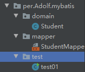
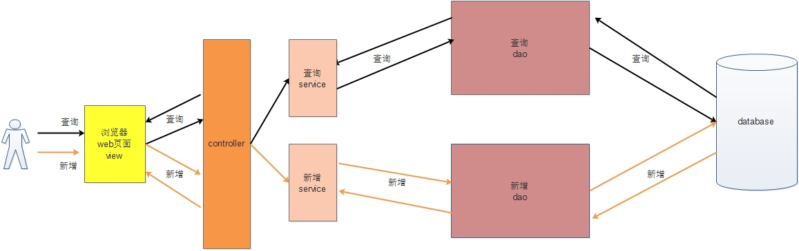

## 0. 总起：什么是框架
> 框架（Framework）是整个或部分系统的可重用设计，表现为一组抽象构件及构件实例间交互的方法;另一种定义认为，框架是可被应用开发者定制的应用骨架。前者是从应用方面而后者是从目的方面给出的定义。 
> 简而言之，框架其实就是某种应用的半成品，就是一组组件，供你选用完成你自己的系统。简单说就是使用别人搭好的舞台，你来做表演。而且，框架一般是成熟的，不断升级的软件。

### 0.1 框架的重要性
> 框架的重要性在于它实现了部分功能，并且能够很好的将低层应用平台和高层业务逻辑进行了缓和。为了实现软件工程中的“高内聚、低耦合”。把问题划分开来各个解决，易于控制，易于延展，易于分配资源。我们常见的MVC软件设计思想就是很好的分层思想。

## 1. mybatis概述
### 1.1 mybatis简述
- MyBatis是支持定制化SQL，存储过程以及高级映射的优秀持久层框架。
- 避免了几乎所有JDBC代码和手动设置参数以及获取结果集
- Mybatis可以使用简单的XML或者注解用于配置和原始映射，将接口和Java的POJO（Plain Old Java Object）映射成数据库中的记录
- **对jdbc所有数据库进行封装（包括加载驱动，创建connection，创建statement，手动设置参数，结果集检索等等）**
 
### 1.2 为什么使用MyBatis
MyBatis是一个半自动的持久化层框架

使用JDBC编程---当使用jdbc时候，sql语句被硬编译到java代码中，导致：
1. 耦合度太高coupling
2. 代码不易于维护
3. 现实开发中，经常添加sql或者修改sql语句，这样我们只能在java中修改，改好后需要重新编译和发布

Hibernate和JPA（Java Persistence Api Java持久层接口）
> JPA和Hibernate之间的关系，可以简单的理解为JPA是标准接口，Hibernate是实现。

1. Hibernate的优点也是它的缺点，不需要掌握sql语言也可以操作数据库，但是不容易做优化处理

---
- 对于开发人员，核心sql还是需要自己优化
- sql和java编码分开，一个专注于业务，一个专注于数据
- 使用xml或者注解用于配置和原始映射，将接口和java的POJO映射成数据库的记录。成为业务代码+底层数据库的媒介

## 2. mybatis框架搭建

### 2.1 MyBatis搭建

搭建步骤：

1. 创建新Project ->  勾选Web Application -> 项目名 -> Finish

2. 添加依赖包：在WEB-INF上建lib文件夹，把mybatis, log4j, mysql的jar包，右击add as libraries // 或者可以在project Structure-> Libraries-> 添加jar包

3. 在src文件夹下，建立主配置文件mybatis-config.xml

拷贝

```xml
<?xml version="1.0" encoding="UTF-8" ?>
<!DOCTYPE configuration
        PUBLIC "-//mybatis.org//DTD Config 3.0//EN"
        "http://mybatis.org/dtd/mybatis-3-config.dtd">
<configuration>

    <environments default="development">
        <environment id="development">
            <transactionManager type="JDBC"/>
            <dataSource type="POOLED">
                <property name="driver" value="com.mysql.cj.jdbc.Driver"/>这里输入你JDBC Driver的地址
                <property name="url" value="jdbc:mysql://localhost:3306/mybatis"/>这里输入jdbc:你用的数据库名字
                <property name="username" value="root"/>数据库用户名
                <property name="password" value="password"/>数据库密码
            </dataSource>
        </environment>
    </environments>


    这里对应二级映射，映射到的StudentMapper.xml文件是写sql代码的，二级映射在下面的步骤显示
    <mappers>
        注意resource的格式
        <mapper resource="per/Adolf/mybatis/mapper/StudentMapper.xml"/>
    </mappers>
</configuration>
```

4. 新建domain文件夹作为类的保存包，新建mapper文件夹做为映射xml文件的文件夹，新建test作为主运行程序的文件夹



5. 二级映射StudentMapper.xml，代码如下

```xml
<?xml version="1.0" encoding="UTF-8" ?>
<!DOCTYPE mapper
        PUBLIC "-//mybatis.org//DTD Mapper 3.0//EN"
        "http://mybatis.org/dtd/mybatis-3-mapper.dtd">

<!--
    namespace: 命名空间
        将来我们在程序中要找到指定的sql语句来执行
        找到sql语句的方式

        namespace.sqlId的形式

        student.getById
        不同的Mapper映射文件namespace必须是不同的
        同一份mapper映射文件中sqlId必须是不同的
-->

<mapper namespace="student">
<!--
    id: 当前mapper映射文件中sql标签对的唯一标识
    parameterType: 传递参数的类型
    resultType: 查询得到的结果的返回值
-->

第一个SQL查询语法
    parameterType: 代表你参数#{id}是哪个类型的
    resultType: 代表你返回的是什么参数，这里返回是Student这个类
    
    <select id="getById" parameterType="java.lang.Integer" resultType="per.Adolf.mybatis.domain.Student">

        select * from t_user where id = #{id}

    </select>


<!--
    注意：
        返回的结果为多条记录信息，那么MyBatis会根据返回值类型创建多个对象，然后将兑现自动保存到List中
        resultType： 要写集合的泛型类型
-->
    <select id="getAll"  resultType="per.Adolf.mybatis.domain.Student" >

        select * from t_user

    </select>


<!--
     注意：
        对于添加修改删除操作所对应的标签
        分别是：
        <insert>标签
        <update>标签
        <delete>标签

        这3个标签，只写id属性，其他属性不写
-->
    <insert id="save" >
        insert into t_user(name, age) values ( #{name}, #{age})
    </insert>

    <update id="update">
        update t_user set name=#{name}, age=#{age} where id = #{id}
    </update>

    <delete id="delete" >
        delete from t_user where id = #{id}
    </delete>

</mapper>
```

6. 主方法步骤

```java
//1. 通过读取mybatis的主配置文件(mybatis-config.xml) 
String resource = "mybatis-config.xml";
InputStream inputStream = null;
// 2. 创建一个Sqlsession工厂的建造者（SqlSessionFactoryBuilder）
try {
    inputStream = Resources.getResourceAsStream(resource);        
} catch (IOException e) {
    System.out.println("111");
    e.printStackTrace();
}
// 3. 通过该建造者调用建造方法，创建一个sqlSession工厂(SqlSessionFactory) 
SqlSessionFactory sqlSessionFactory = new SqlSessionFactoryBuilder().build(inputStream);
// 4. 通过SqlSessionFactory工厂获得我们需要的SqlSession对象 
SqlSession sqlSession = sqlSessionFactory.openSession();
// 5. 以后我们就用SqlSession对象来控制数据库
// 以下是具体需求
//-------------------------------------------------------------
        // 需求，根据id： 1，查询该id对应学生的详细信息
        /*
        * 参数1： 通过 命名空间.sqlID找到需要执行的sql语句
        * 参数2： 为sql语句传递参数
        * */
//        Student o = sqlSession.selectOne("student.getById", 1);
//        System.out.println("\n\n"+o + "\n\n");
//-------------------------------------------------------------
        // 需求： 查询学生信息列表
//        List<Student> alist = sqlSession.selectList("student.getAll");
//        System.out.println("\n\n" + alist + "\n\n");
//-------------------------------------------------------------
        // 需求： 完成添加操作
        /*
        *  MyBaits是手动提交事务机制
        *
        * 不论是基础的增删改查，还是比较高级的事务操作，我们一律使用SqlSession sqlSession对象进行操作执行
        * */
//        Student student = new Student();
//        student.setAge(19);
//        student.setName("傻逼Tom");
//        student.setId(3);
//        int count = sqlSession.insert("student.save", student);
//        sqlSession.commit();
//        System.out.println("受影响条数" + count);
//-------------------------------------------------------------
        // 需求： 更改数据
//        Student student2 = new Student();
//        student2.setAge(1);
//        student2.setName("傻逼Tom");
//        student2.setId(3);
//        int update = sqlSession.update("student.update", student2);
//        sqlSession.commit();
//        System.out.println("受影响条数" + update);
//-------------------------------------------------------------
        // 需求： 删除数据
//        int delete = sqlSession.delete("student.delete", "4");
//        sqlSession.commit();
//        System.out.println("受影响条数" + delete);
//        sqlSession.close();
```

7. log4j配置文件，在src文件夹下生成一个log4j.properties文件，配置如下

```properties
### 设置###
log4j.rootLogger = debug,stdout,D,E

### 输出信息到控制抬 ###
log4j.appender.stdout = org.apache.log4j.ConsoleAppender
log4j.appender.stdout.Target = System.out
log4j.appender.stdout.layout = org.apache.log4j.PatternLayout
log4j.appender.stdout.layout.ConversionPattern = [%-5p] %d{yyyy-MM-dd HH:mm:ss,SSS} method:%l%n%m%n

### 输出DEBUG 级别以上的日志到=E://logs/error.log ###
log4j.appender.D = org.apache.log4j.DailyRollingFileAppender
log4j.appender.D.File = E://logs/log.log
log4j.appender.D.Append = true
log4j.appender.D.Threshold = DEBUG 
log4j.appender.D.layout = org.apache.log4j.PatternLayout
log4j.appender.D.layout.ConversionPattern = %-d{yyyy-MM-dd HH:mm:ss}  [ %t:%r ] - [ %p ]  %m%n

### 输出ERROR 级别以上的日志到=E://logs/error.log ###
log4j.appender.E = org.apache.log4j.DailyRollingFileAppender
log4j.appender.E.File =E://logs/error.log 
log4j.appender.E.Append = true
log4j.appender.E.Threshold = ERROR 
log4j.appender.E.layout = org.apache.log4j.PatternLayout
log4j.appender.E.layout.ConversionPattern = %-d{yyyy-MM-dd HH:mm:ss}  [ %t:%r ] - [ %p ]  %m%n
```
### 2.2 MyBatis解决JDBC存在的问题
   1. 获取连接，得到statement，处理rs，关闭资源非常繁琐
   2. 将sql语句写到java代码中，如果修改sql语句，需要修改java代码&重新编译，程序维护性不高 
       - SQL语句配置在Mapper.xml文件中与java代码分离
   3. 向PreparedStatement对占位符的位置设置参数时，非常繁琐  
       - Mybatis自动将java对象映射到sql语句，通过statement中的parameterType定义输入参数的类型
   4. 解析结果集时 需要把字段值设置到相应的实体类属性名中。 
       - Mybatis自动将sql执行结果映射到java对象，通过statement中的resultType定义输出结果的类型


### Mybatis的MVC模型
> MVC = View + Control + Model(Service + DAO(更底层))

MVC的分层开发：
    1. View 视图层： 用于展示数据，与用户进行交互
    2. Controller 控制层： 接受请求， 接收参数，为浏览器做出相应
    3. Service 业务层： 处理业务逻辑（比如转账，只能在业务层上进行，因为有很多个DAO操作）
    4. DAO ： 与数据库做交互

    


- src
    - dao(与数据库交互的)
    - service(业务层：处理业务逻辑)
    - util(多用途包，产生SqlSessionFactory)
    - domain(类存储：Student类)
    - mapper(映射xml存储)
    - test(Junit Test)


## 实践案例
> 需求：    
    开发一套OA办公室自动化系统，甲方用了两年的时间，系统很稳定    
    此时（甲方）提出新需求，要求在业务逻辑上新增日志信息打印功能(新增前print 添加操作开始，新增后print 添加操作结束)

```java
甲方源代码

UserService接口代码
public interface UserService {
    public void save();
    public void update();
    public void delete();
    public void select();
}

UserServiceImpl类代码
public class UserServiceImpl implements UserService {
    @Override
    public void save() {
        System.out.println("执行用户添加操作");
    }

    @Override
    public void update() {
        System.out.println("执行用户更改操作");
    }

    @Override
    public void delete() {
        System.out.println("执行用户删除操作");
    }

    @Override
    public void select() {
        System.out.println("执行用户查询操作");
    }
}
```

开闭原则 ：
- 在一个原有的成熟稳定项目的基础之上，我们应该以源文件为单位，对添加开放，对修改关闭
- 意思是：源文件不能轻易修改，       
    1. 可能会导致未知bug        
    2. 源文件可能是别的文件的依赖
- 解决方法： 
    - 建立添加代理源文件类UserServiceProxy

**源文件为：UserServiceImpl    代理源文件为：UserServiceProxy 都实现UserService接口**
- UserServiceImpl类 ： 处理业务逻辑的
- UserServiceProxy类
    1. 通过调用成员变量UserServiceImpl类 实现业务逻辑
    2. 在业务逻辑基础上的功能的扩充

```java

UserServiceProxy类代码
public class UserServiceProxy implements UserService {

    private UserServiceImpl usi;

    public UserServiceProxy(UserServiceImpl usi) {
        this.usi = usi;
    }

    @Override
    public void save() {
        System.out.println("添加用户操作----日志记录开始");
        usi.save();
        System.out.println("添加用户操作----日志记录结束");
    }

    @Override
    public void update() {
        System.out.println("更新用户操作----日志记录开始");
        usi.update();
        System.out.println("更新用户操作----日志记录结束");
    }

    @Override
    public void delete() {
        System.out.println("删除用户操作----日志记录开始");
        usi.delete();
        System.out.println("删除用户操作----日志记录结束");
    }

    @Override
    public void select() {
        System.out.println("查询用户操作----日志记录开始");
        usi.select();
        System.out.println("查询用户操作----日志记录结束");
    }
}
```


# 3. 动态代理
### 事务层的动态代理
在业务层做动态代理，代理的目的是为了代理事务。原因：
- 因为永远在业务层，处理业务逻辑。
- 而与数据库层相关的代码应该是在DAO层写的
- 但是，在DAO写commit方法，会导致提交 很多次事务
- 所以，在业务层创建一个代理类，帮他写

> 业务层的动态代理是自己写的

其实我没搞清楚到底这个是怎么用的，代码如下
- 在util文件夹下创建两个类，TransactionInvacationHandler & ServiceFactory类

```java
TransactionInvacationHandler 类
public class TransactionInvacationHandler implements InvocationHandler {

    //
    private Object target;

    public TransactionInvacationHandler(Object target) {
        this.target = target;
    }

    /*
    * invoke：
    *      	业务方法
    *       由两部分代码构成
    *       1. 使用impl实现业务逻辑
    *       2. 对impl业务逻辑的扩充
    *
    * */

    @Override
    public Object invoke(Object proxy, Method method, Object[] args) throws Throwable {

        SqlSession session = null;
        Object object = null;

        try {

            session = SqlSessionUtil.getSession();
//--------------------------------------------------------------

            // 处理业务逻辑
            /*
            * impl调用业务逻辑方法
            * : target
            * 方法： method
            * 方法参数： arg
            * 返回值： obj
            * */
            object = method.invoke(target, args);

//--------------------------------------------------------------
            // 提交事务
            session.commit();
        } catch (Exception e) {
            session.rollback();
            System.out.println(e);
        } finally {
            SqlSessionUtil.CloseSession(session);
        }

        return object ;
    }

    // 取得ls对象
    public Object getProxy() {
        return Proxy.newProxyInstance(target.getClass().getClassLoader(), target.getClass().getInterfaces(), this);
    }
}
```

```java
ServiceFactory 类
public class ServiceFactory {

    public static Object getService(Object service){

        return new TransactionInvacationHandler(service).getProxy();
    }

}
```

### DAO层的动态代理
在DAO层做动态代理的原因是：在DAO层写impl实现类代码本身就是一种不方便

> DAO层的动态代理是MyBatis独有的机制，由框架帮我们实现

DAO层
步骤1. 创建StudentDAO接口 和 StudentDAO.xml文件 如下
- 注意：
    1. 两个文件必须在同一个文件夹内
    2. StudentDAO.xml的namespace必须是 per.adolf.dao.StudentDAO 接口完整路径，不能随便起名字
    3. 注意接口和xml的返回值需要一致
代码：
StudentDAO
```java
public interface StudentDAO {
    // 增
    public void save(Student student);
    // 删
    // 查
    public Student getById(int id);
    public List<Student> getAll();
    // 改
}
```

StudentDAO.xml

```xml
<?xml version="1.0" encoding="UTF-8" ?>
<!DOCTYPE mapper
        PUBLIC "-//mybatis.org//DTD Mapper 3.0//EN"
        "http://mybatis.org/dtd/mybatis-3-mapper.dtd">
        <mapper namespace="per.adolf.dao.StudentDAO">
<!--
    id: 当前mapper映射文件中sql标签对的唯一标识
    parameterType: 传递参数的类型
    resultType: 查询得到的结果的返回值

-->
    <select id="getById" parameterType="java.lang.Integer" resultType="per.adolf.domain.Student">

        select * from t_user where id = #{id}

    </select>
<!--
    注意：
        返回的结果为多条记录信息，那么MyBatis会根据返回值类型创建多个对象，然后将兑现自动保存到List中
        resultType： 要写集合的泛型类型
-->
    <select id="getAll"  resultType="per.adolf.domain.Student" >

        select * from t_user

    </select>

<!--
     注意：
        对于添加修改删除操作所对应的标签
        分别是：
        <insert>标签
        <update>标签
        <delete>标签

        这3个标签，只写id属性，其他属性不写
-->
    <insert id="save" >
        insert into t_user(name, age) values ( #{name}, #{age})
    </insert>

    <update id="update">
        update t_user set name=#{name}, age=#{age} where id = #{id}
    </update>

    <delete id="delete" >
        delete from t_user where id = #{id}
    </delete>
</mapper>
```

Service层：有两个 StudentService接口，StudentServiceImpl类
```java
public interface StudentService {

    public void save(Student student);

    public Student getById(int id);
    
    List<Student> getAll();
}

public class StudentServiceImpl implements StudentService {

    private StudentDAO studentDAO = SqlSessionUtil.getSession().getMapper(StudentDAO.class);

    @Override
    public void save(Student student) {
        studentDAO.save(student);
    }

    @Override
    public Student getById(int id) {
        Student s = studentDAO.getById(id);
        return s;
    }

    @Override
    public List<Student> getAll() {
        List<Student> students = studentDAO.getAll();

        return students;

    }
}
```

Control层：使用Service的动态代理，创建出StudentService接口的对象，然后正常的使用StudentService接口的方法

```java
public class Test03 {
    public static void main(String[] args) {
//        创建业务层对象
        StudentService ss = (StudentService) ServiceFactory.getService(new StudentServiceImpl());

        // 需求：实现学生添加操作
        Student student= new Student();
        student.setAge(10);
        student.setId(4);
        student.setName("刘雨昕");
        ss.save(student);

        // 需求： 根据id查数据
        int id = 7;
        Student student = ss.getById(id);
        System.out.println(student);

        // 需求：查询所有学生的详细信息
        List<Student> studentList = ss.getAll();
        for (Student student : studentList) {
            System.out.println(student);
        }
    }
}
```